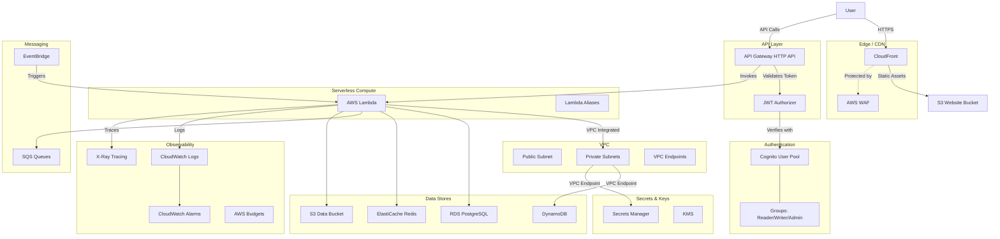
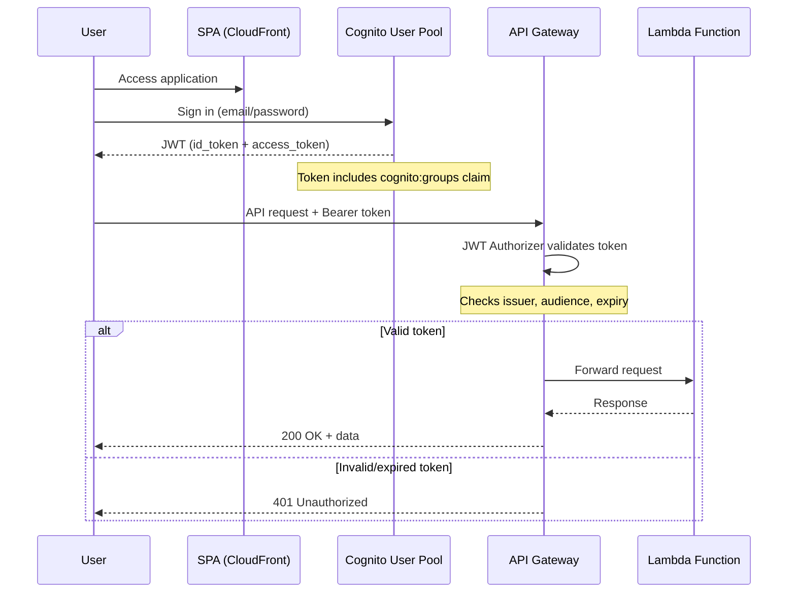

# AWS Infrastructure Makefile

Automated AWS infrastructure provisioning via `make` targets and AWS CLI. Equivalent to the Azure infrastructure Makefile, adapted for AWS services.

## Architecture



## Auth Flow



## Provisioning Order

```mermaid
graph LR
    A[1. Account Setup] --> B[2. VPC]
    B --> C[3. Secrets/KMS]
    C --> D[4. S3 Buckets]
    D --> E[5. Cognito]
    E --> F[6. Lambda Role + Function]
    F --> G[7. API Gateway]
    G --> H[8. DynamoDB/RDS/Redis]
    H --> I[9. SQS/EventBridge]
    I --> J[10. CloudFront + WAF]
    J --> K[11. Monitoring/Budgets]
    K --> L[12. Deploy]
```



## Prerequisites

- **AWS CLI v2** — authenticated via `aws configure` or `aws sso login`
- **Python 3.8+** — for helper scripts (stdlib only, no dependencies)
- **GNU Make 4.0+**
- **IAM permissions** — the calling principal needs permission to create each service (broadly: `AdministratorAccess` for bootstrapping, or a scoped policy covering the services you use — Lambda, API Gateway, Cognito, VPC, S3, IAM, CloudFront, WAF, Secrets Manager, KMS, Route 53, ACM, CloudWatch, RDS, ElastiCache, DynamoDB, SQS, EventBridge, Budgets)
- **Lambda deploy artifact** — `create-lambda` and `deploy-lambda` expect a `function.zip` file in the current directory

### Region-specific constraints

- **CloudFront + WAF**: the WAF WebACL for CloudFront must be in `us-east-1` regardless of where other resources live. `create-waf` hardcodes this.
- **ACM certs for CloudFront**: must also be in `us-east-1`. `request-cert` defaults to that region; override with `CERT_REGION=<region>` for API Gateway custom domains (which can use regional certs).

## Quick Start

This walks through the full stack end to end. Run commands sequentially — later targets read `.env` values saved by earlier ones.

```bash
# 1. Verify access + capture account/region
make show-account

# 2. Networking
make create-vpc VPC_NAME=myapp-vpc

# 3. KMS + secrets
make create-kms-key n=myapp-key

# 4. Storage (Lambda code + static site)
make create-s3 BUCKET_NAME=myapp-lambda-$(aws sts get-caller-identity --query Account --output text) env=dev use=lambda
make create-s3 BUCKET_NAME=myapp-web-$(aws sts get-caller-identity --query Account --output text) env=dev use=web

# 5. Auth
make create-user-pool POOL_NAME=myapp-users
make create-user-pool-client CLIENT_NAME=myapp-spa callback=http://localhost:3000
make create-user-pool-domain DOMAIN_PREFIX=myapp-auth
make create-cognito-groups

# 6. Lambda (you must have function.zip built before this)
make create-lambda-role LAMBDA_ROLE_NAME=myapp-lambda-role
make assign-lambda-policies LAMBDA_ROLE_NAME=myapp-lambda-role
make create-lambda FUNC_NAME=myapp-api runtime=python3.12 LAMBDA_ROLE_NAME=myapp-lambda-role

# 7. API Gateway
make create-api-gw API_NAME=myapp-api
make api-gw-add-authorizer
make api-gw-add-lambda FUNC_NAME=myapp-api path=/items method=GET
make api-gw-deploy stage=dev

# 8. CDN (note: BUCKET_NAME is the web bucket from step 4)
make create-cloudfront BUCKET_NAME=myapp-web-<account-id>
make create-waf
make attach-waf

# 9. Data (optional, depends on your app)
make create-db-subnet-group DB_SUBNET_GROUP=myapp-db-subnets
make create-rds DB_NAME=myapp-db env=dev DB_SUBNET_GROUP=myapp-db-subnets
make create-cache-subnet-group CACHE_SUBNET_GROUP=myapp-cache-subnets
make create-redis REDIS_NAME=myapp-redis env=dev CACHE_SUBNET_GROUP=myapp-cache-subnets
make create-dynamodb TABLE_NAME=myapp-items pk=id env=dev

# 10. Observability + cost guardrails
make create-budget BUDGET_AMOUNT=100 BUDGET_EMAIL=team@example.com
make enable-xray FUNC_NAME=myapp-api
make create-alarm FUNC_NAME=myapp-api metric=Errors

# 11. Deploy the static site
make deploy-web dir=./build BUCKET_NAME=myapp-web-<account-id>
```

### Custom domain (optional)

```bash
# Request certificate (must be in us-east-1 for CloudFront)
make request-cert DOMAIN=www.myapp.com

# Validate it via Route 53 (assumes you own the hosted zone)
make validate-cert-route53 DOMAIN=www.myapp.com HOSTED_ZONE_ID=Z1234567890ABC

# After cert issues (check the AWS console), point DNS at CloudFront
make create-dns-alias DOMAIN=www.myapp.com HOSTED_ZONE_ID=Z1234567890ABC
```


## Command Reference

### Account & Tags
| Target | Purpose | Required Params |
|--------|---------|-----------------|
| `show-account` | Show AWS account info, save to .env | — |
| `tag-resources` | Tag all project resources | `env=<value>` |
| `list-resources` | List all tagged resources | — |

### Secrets Manager
| Target | Purpose | Required Params |
|--------|---------|-----------------|
| `create-secret` | Create a secret | `n=<name>`, `v=<value>` |
| `list-secrets` | List all secrets | — |
| `show-secret` | Show secret value | `n=<name>` |
| `update-secret` | Update secret value | `n=<name>`, `v=<value>` |
| `delete-secret` | Soft-delete (30-day recovery) | `n=<name>` |
| `purge-secret` | Permanently delete | `n=<name>` |

### KMS Keys
| Target | Purpose | Required Params |
|--------|---------|-----------------|
| `create-kms-key` | Create KMS key with alias | `n=<alias>` |
| `list-kms-keys` | List key aliases | — |
| `delete-kms-key` | Schedule key deletion | `n=<alias>` |

### .env Backup/Restore
| Target | Purpose | Required Params |
|--------|---------|-----------------|
| `backup-env` | Upload .env to Secrets Manager | — |
| `restore-env` | Restore .env from Secrets Manager | — |

### S3 Storage
| Target | Purpose | Required Params |
|--------|---------|-----------------|
| `create-s3` | Create bucket with env/use config | `BUCKET_NAME`, `env=dev\|prod\|disaster`, `use=web\|lambda\|data` |
| `delete-s3` | Delete bucket and contents | `BUCKET_NAME` |

### Lambda Functions
| Target | Purpose | Required Params |
|--------|---------|-----------------|
| `create-lambda-role` | Create IAM execution role | `LAMBDA_ROLE_NAME` |
| `create-lambda` | Create Lambda function | `FUNC_NAME`, `runtime=`, `LAMBDA_ROLE_NAME` |
| `deploy-lambda` | Update function code | `FUNC_NAME` |
| `create-lambda-alias` | Create alias (blue/green) | `FUNC_NAME`, `n=<alias>` |
| `shift-traffic` | Weighted traffic routing | `FUNC_NAME`, `n=<alias>`, `weight=<0-100>` |

### Cognito Auth
| Target | Purpose | Required Params |
|--------|---------|-----------------|
| `create-user-pool` | Create Cognito User Pool | `POOL_NAME` |
| `create-user-pool-client` | Create app client | `CLIENT_NAME` |
| `create-user-pool-domain` | Create hosted UI domain | `DOMAIN_PREFIX` |
| `create-cognito-groups` | Create Reader/Writer/Admin groups | — |
| `assign-user-group` | Add user to group | `username=`, `group=` |

### API Gateway
| Target | Purpose | Required Params |
|--------|---------|-----------------|
| `create-api-gw` | Create HTTP API | `API_NAME` |
| `api-gw-add-authorizer` | Add Cognito JWT authorizer | — |
| `api-gw-add-lambda` | Add Lambda integration + route | `FUNC_NAME`, `path=`, `method=` |
| `api-gw-deploy` | Deploy to stage | `stage=<name>` |
| `api-gw-cors` | Configure CORS | `origin=<url>` |
| `api-gw-throttle` | Set rate limiting | `rate=`, `burst=` |

### VPC & Networking
| Target | Purpose | Required Params |
|--------|---------|-----------------|
| `create-vpc` | Create VPC with subnets | `VPC_NAME` |
| `create-vpc-endpoint` | Create VPC endpoint | `service=<s3\|secretsmanager\|dynamodb>` |
| `lambda-vpc-config` | Attach Lambda to VPC | `FUNC_NAME` |

### CloudFront & WAF
| Target | Purpose | Required Params |
|--------|---------|-----------------|
| `create-cloudfront` | Create distribution for S3 | `BUCKET_NAME` |
| `create-waf` | Create WAF with managed rules | — |
| `attach-waf` | Attach WAF to CloudFront | — |

### Monitoring
| Target | Purpose | Required Params |
|--------|---------|-----------------|
| `create-log-group` | Create CloudWatch log group | `n=<name>` |
| `enable-xray` | Enable X-Ray on Lambda | `FUNC_NAME` |
| `create-alarm` | Create CloudWatch alarm | `FUNC_NAME`, `metric=` |

### DynamoDB
| Target | Purpose | Required Params |
|--------|---------|-----------------|
| `create-dynamodb` | Create table | `TABLE_NAME`, `pk=`, `env=` |
| `delete-dynamodb` | Delete table | `TABLE_NAME` |

### SQS
| Target | Purpose | Required Params |
|--------|---------|-----------------|
| `create-sqs` | Create queue (FIFO for prod) | `n=<name>`, `env=` |
| `delete-sqs` | Delete queue | `n=<name>` |

### EventBridge
| Target | Purpose | Required Params |
|--------|---------|-----------------|
| `create-eventbridge-rule` | S3 event → Lambda rule | `n=`, `BUCKET_NAME`, `FUNC_NAME` |

### RDS
| Target | Purpose | Required Params |
|--------|---------|-----------------|
| `create-db-subnet-group` | Create RDS DB subnet group from VPC private subnets | `DB_SUBNET_GROUP` |
| `create-rds` | Create PostgreSQL instance (password stored in Secrets Manager) | `DB_NAME`, `env=`, `DB_SUBNET_GROUP` |

### ElastiCache
| Target | Purpose | Required Params |
|--------|---------|-----------------|
| `create-cache-subnet-group` | Create ElastiCache subnet group | `CACHE_SUBNET_GROUP` |
| `create-redis` | Create Redis cluster | `REDIS_NAME`, `env=`, `CACHE_SUBNET_GROUP` |

### Custom Domain (ACM + Route 53)
| Target | Purpose | Required Params |
|--------|---------|-----------------|
| `request-cert` | Request ACM certificate (us-east-1 for CloudFront) | `DOMAIN` |
| `validate-cert-route53` | Create DNS validation records | `DOMAIN`, `HOSTED_ZONE_ID` |
| `attach-domain-cloudfront` | Print instructions to attach domain to CloudFront | `DOMAIN` |
| `create-dns-alias` | A-record alias from domain to CloudFront | `DOMAIN`, `HOSTED_ZONE_ID` |

### Budgets
| Target | Purpose | Required Params |
|--------|---------|-----------------|
| `create-budget` | Monthly budget with alerts | `BUDGET_AMOUNT`, `BUDGET_EMAIL` |

### IAM & CI/CD
| Target | Purpose | Required Params |
|--------|---------|-----------------|
| `assign-lambda-policies` | Grant Lambda access to services | `LAMBDA_ROLE_NAME` |
| `create-cicd-user` | Create CI/CD user + store creds | `CICD_USER` |

### Deployment
| Target | Purpose | Required Params |
|--------|---------|-----------------|
| `deploy-web` | Sync to S3 + invalidate CDN | `dir=`, `BUCKET_NAME` |
| `backup-secrets` | Backup all secrets locally | — |

## Variables

| Variable | Description | Default |
|----------|-------------|---------|
| `AWS_REGION` | AWS region for all resources | `us-east-1` |
| `PROJECT_TAG` | Project name tag applied to all resources | `my-project` |
| `ENV_TAG` | Default environment tag | `dev` |
| `ENV_FILE` | Path to .env file (for env_tool.py) | `.env` |

## .env File

The `.env` file is auto-populated by targets as resources are created:

```bash
ACCOUNT_ID=123456789012
AWS_REGION=us-east-1
VPC_ID=vpc-abc123
PUBLIC_SUBNET=subnet-pub123
PRIVATE_SUBNET_1=subnet-priv1
PRIVATE_SUBNET_2=subnet-priv2
COGNITO_POOL_ID=us-east-1_AbCdEf
COGNITO_CLIENT_ID=1234567890abcdef
API_GW_ID=abc123def4
API_GW_AUTHORIZER_ID=auth123
LAMBDA_ROLE_ARN=arn:aws:iam::123456789012:role/my-role
CLOUDFRONT_DIST_ID=E1234567890
```

## Python Helper Scripts

| Script | Purpose |
|--------|---------|
| `scripts/env_tool.py` | Atomic .env management (set/unset/get/dump/restore) |
| `scripts/api_gw_policy.py` | Generate API Gateway authorizer/CORS/throttle JSON |
| `scripts/cognito_roles.py` | Manage Cognito groups and user assignments (uses subprocess list args to avoid shell injection) |
| `scripts/budget_helper.py` | Generate budget JSON and compute dates |
| `scripts/lambda_routing.py` | Generate Lambda alias routing-config JSON for weighted traffic (replaces `bc` dependency) |

All scripts use Python stdlib only — no pip dependencies required.

## Gotchas

- **CloudFront distributions take 15-30 minutes to deploy** — `create-cloudfront` returns quickly but the distribution isn't usable until status is `Deployed`. Check with `aws cloudfront get-distribution --id <id>`.
- **WAF scope for CloudFront must be `us-east-1`** — this is an AWS platform constraint, not a Makefile limitation. Regional API Gateway WAFs use their local region.
- **ACM certs for CloudFront must be in `us-east-1`** — `request-cert` defaults to this. Override with `CERT_REGION=<region>` for API Gateway regional/edge certs.
- **S3 bucket names must be globally unique** — append your account ID or a random suffix.
- **Attaching a custom domain to an existing CloudFront distribution** requires updating the full distribution config (etag + config JSON). `attach-domain-cloudfront` prints guidance; for most cases it's easier to recreate the distribution with the domain.
- **RDS/ElastiCache require subnet groups** — run `create-db-subnet-group` / `create-cache-subnet-group` first.
- **Cognito hosted UI requires callback URLs** — pass `callback=<url>` to `create-user-pool-client` if you plan to use the hosted UI or OAuth code flow.
- **Lambda logs are auto-created** but without explicit retention. Use `create-log-group n=/aws/lambda/<func>` to set 30-day retention.
- **.env updates mid-invocation** — targets that depend on values set by earlier targets should be run as separate `make` invocations, since `-include .env` is evaluated at Makefile parse time. `$(shell $(ENV_GET) KEY)` is evaluated at recipe expansion time, so it sees the latest `.env`, but relying on that is fragile. Prefer running each logical phase separately.

## Best Practices

1. **No hardcoded IDs** — All ARNs and IDs are resolved via `aws` CLI queries or read from `.env`
2. **Tag everything** — All resources get `Project` and `Environment` tags for cost tracking and grouping
3. **Secrets in Secrets Manager** — Never store credentials in code; auto-generated passwords go to Secrets Manager
4. **VPC isolation** — Lambda functions run in private subnets; use VPC endpoints for AWS service access
5. **Least privilege** — Use managed policies; scope down for production
6. **Blue/green deploys** — Lambda aliases with weighted traffic shifting for safe rollouts
7. **Encryption by default** — S3 SSE, RDS encryption, ElastiCache at-rest + in-transit encryption
8. **Budget alerts** — Always set budget alerts before provisioning expensive resources
9. **Backup .env** — Use `make backup-env` to persist configuration to Secrets Manager
10. **Environment parity** — Use `env=dev|prod` parameter to get appropriate sizing/redundancy

## Azure → AWS Mapping

| Azure | AWS (this project) |
|-------|-------------------|
| Resource Group | Tags (Project=X) |
| Key Vault secrets | Secrets Manager |
| Key Vault keys | KMS |
| Storage Account (web) | S3 + CloudFront |
| Function App | Lambda |
| API Management | API Gateway (HTTP API) |
| Entra ID + App Roles | Cognito User Pool + Groups |
| VNet | VPC |
| Private Endpoints | VPC Endpoints |
| Front Door | CloudFront |
| WAF | AWS WAF |
| Service Bus | SQS |
| Cosmos DB | DynamoDB |
| Redis Cache | ElastiCache Redis |
| Azure SQL | RDS PostgreSQL |
| Event Grid | EventBridge |
| App Insights | CloudWatch + X-Ray |
| Azure Budget | AWS Budgets |
| Deployment Slots | Lambda Aliases |
| Azure Policy | Config Rules / SCPs |
