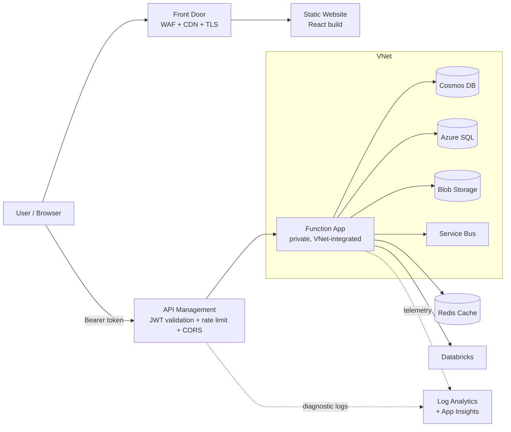
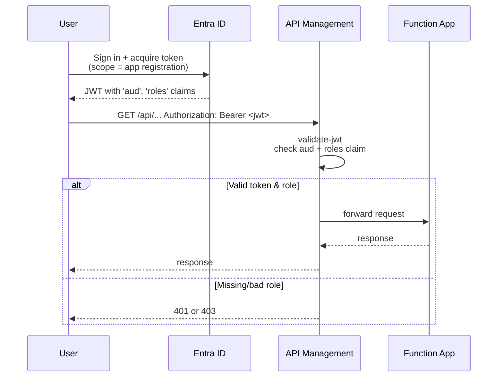
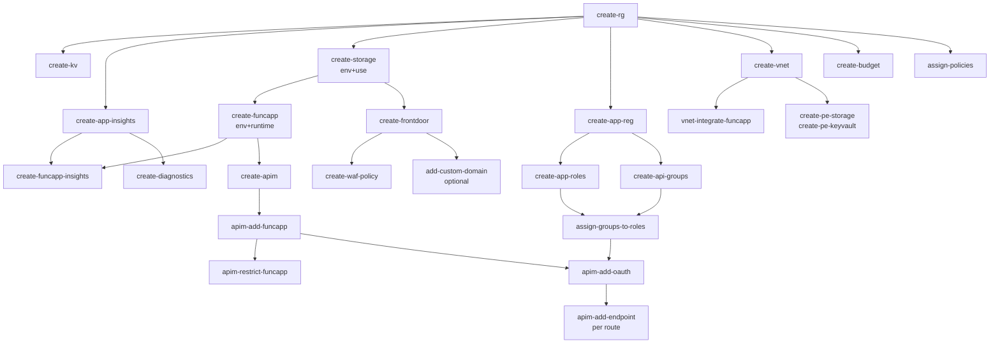
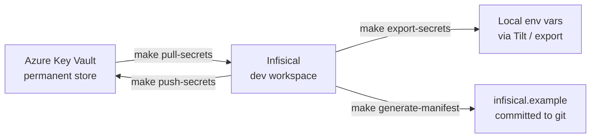

# Azure Infrastructure Makefile

A Makefile-driven workflow for provisioning and managing a full Azure application stack: React static site → Front Door → API Management → Azure Functions → Cosmos/SQL/Storage/Service Bus, with Entra ID auth, VNet isolation, monitoring, and governance.

Complex logic (XML policy generation, JSON construction, ID lookups, `.env` manipulation) is offloaded to Python helpers in `scripts/` so the Makefile stays declarative.

---

## Table of Contents

- [Prerequisites](#prerequisites)
- [Quick Start](#quick-start)
- [Architecture](#architecture)
- [Auth Flow](#auth-flow)
- [Provisioning Order](#provisioning-order)
- [Command Reference](#command-reference)
- [Variables](#variables)
- [Python Helpers](#python-helpers)
- [Best Practices](#best-practices)
- [Migrating to Terraform or Bicep](#migrating-to-terraform-or-bicep)

---

## Prerequisites

- **Azure CLI** — `az login` completed
- **GNU Make** — 4.0+
- **Python 3.8+** — used by helper scripts (stdlib only, no dependencies)
- **openssl** — for generating SQL admin passwords
- **Azure Functions Core Tools** — only for `deploy-funcapp`

Run `make help` to see every available target grouped by category.

---

## Quick Start

```bash
# Foundation
make create-rg RG_NAME=myapp-dev-rg LOCATION=eastus
make create-kv KV_NAME=myapp-dev-kv

# Monitoring
make create-app-insights LOG_ANALYTICS_NAME=myapp-dev-logs APP_INSIGHTS_NAME=myapp-dev-ai

# Storage + Function App
make create-storage env=dev use=functions STORAGE_NAME=myappdevfuncstor
make create-funcapp env=dev runtime=python FUNC_NAME=myapp-dev-api STORAGE_NAME=myappdevfuncstor
make create-funcapp-insights

# Auth
make create-app-reg APP_REG_NAME=myapp-api
make create-app-roles
make create-api-groups
make assign-groups-to-roles

# Gateway
make create-apim APIM_NAME=myapp-apim APIM_PUBLISHER_EMAIL=me@example.com
make apim-add-funcapp swagger=https://myapp-dev-api.azurewebsites.net/api/swagger.json
make apim-restrict-funcapp
make apim-add-oauth
```

---

## Architecture



Key properties:
- Function Apps are never public; `apim-restrict-funcapp` denies everything but APIM.
- APIM is the single auth enforcement point (Entra ID JWT + role checks + rate limiting + CORS).
- Front Door fronts the static React site with CDN, WAF, and managed TLS.
- VNet + private endpoints keep data-plane resources off the public internet.

---

## Auth Flow



Role → AD Group mapping (created by `create-api-groups` + `assign-groups-to-roles`):

| AD Group | App Role |
|----------|----------|
| API-Readers | API.Read |
| API-Writers | API.Write |
| API-Admins | API.Admin |

Add/remove users from these groups in Entra ID to control API access — no app changes needed.

---

## Provisioning Order



The graph shows dependencies, not a sequence — parallel branches can run independently.

---

## Command Reference

All commands are listed in `make help`, grouped by section. Below is the full reference.

### Resource Group

| Command | Purpose | Required params |
|---------|---------|-----------------|
| `create-rg` | Create RG, save IDs | `RG_NAME`, `LOCATION` |
| `list-rg` | List RGs | — |
| `delete-rg` | Delete RG (async) | `RG_NAME` |

### Key Vault

| Command | Purpose | Required params |
|---------|---------|-----------------|
| `create-kv` | Create vault | `KV_NAME` |
| `delete-kv` | Soft-delete vault | `KV_NAME` |
| `purge-kv` | Permanently purge | `KV_NAME`, `LOCATION` |

### Key Vault Secrets / Keys

| Command | Purpose |
|---------|---------|
| `add-secret-kv` / `list-secrets-kv` / `show-secret-kv` / `delete-secret-kv` / `purge-secret-kv` | Secret CRUD (use `n=`, `v=`) |
| `add-key-kv` / `list-keys-kv` / `show-key-kv` / `delete-key-kv` / `purge-key-kv` | Key CRUD (use `n=`) |
| `backup-env` / `restore-env` | Back up `.env` as a Key Vault secret named `env-backup` |

### Storage

| Command | Purpose | Params |
|---------|---------|--------|
| `create-storage` | Storage account | `env=dev\|prod\|disaster`, `use=web\|functions\|databricks`, `STORAGE_NAME` |

**`env` matrix:**

| Value | SKU | Access Tier |
|-------|-----|-------------|
| dev | Standard_LRS | Hot |
| prod | Standard_ZRS | Hot |
| disaster | Standard_GRS | Cool |

**`use` matrix:**

| Value | Extras |
|-------|--------|
| web | Static website (index.html + 404.html fallback), public blob access |
| functions | Plain blob storage for Functions backend |
| databricks | Hierarchical namespace (ADLS Gen2) |

### Function App

| Command | Purpose | Params |
|---------|---------|--------|
| `create-funcapp` | Flex Consumption, Linux, HTTPS-only, managed identity | `env=dev\|prod`, `runtime=node\|dotnet\|python`, `FUNC_NAME`, `STORAGE_NAME` |
| `create-funcapp-insights` | Link App Insights connection string | — |

Supported runtime versions are in the Makefile. Verify with:

```bash
az functionapp list-runtimes --os linux -o table
```

### Application Insights

| Command | Purpose |
|---------|---------|
| `create-app-insights` | Log Analytics workspace + App Insights, saves key + connection string |

### Entra ID (App Registration + Roles + Groups)

| Command | Purpose |
|---------|---------|
| `create-app-reg` | Create app registration + service principal |
| `create-app-roles` | Add API.Read / API.Write / API.Admin roles (UUIDs generated by Python) |
| `create-api-groups` | Create API-Readers / API-Writers / API-Admins groups |
| `assign-groups-to-roles` | Map groups → roles via Graph API |

### API Management

| Command | Purpose | Params |
|---------|---------|--------|
| `create-apim` | Create APIM (Consumption by default) | `APIM_NAME`, `APIM_PUBLISHER_EMAIL` |
| `apim-add-funcapp` | Import function as API | `swagger=<url>` or `spec=<file>` |
| `apim-restrict-funcapp` | Block direct access to function | — |
| `apim-add-oauth` | Whole-API JWT policy (any role) | — |
| `apim-add-endpoint` | Per-operation policy with role | `path=`, `role=`, `method=` (default GET) |
| `apim-rate-limit` | Throttle | `calls=`, `period=` |
| `configure-cors` | CORS + JWT | `origin=` |
| `create-health-probe` | `/health` operation | — |

### VNet & Private Endpoints

| Command | Purpose |
|---------|---------|
| `create-vnet` | VNet with function + PE subnets (10.0.0.0/16) |
| `vnet-integrate-funcapp` | Join function to VNet |
| `create-pe-storage` | Private endpoint for storage |
| `create-pe-keyvault` | Private endpoint for Key Vault |

### Front Door / CDN

| Command | Purpose |
|---------|---------|
| `create-frontdoor` | Front Door with origin pointing to the storage static website (hostname discovered dynamically) |
| `add-custom-domain` | Optional — custom domain with managed TLS |
| `create-waf-policy` | WAF policy with default rules + bot protection |

### Diagnostics & Alerts

| Command | Purpose |
|---------|---------|
| `create-diagnostics` | Ship APIM + Function logs to Log Analytics |
| `create-budget` | Monthly budget with 80%/100% email alerts |

### Service Bus / Cosmos DB / Redis / SQL

| Command | Purpose |
|---------|---------|
| `create-servicebus` / `create-servicebus-queue` | Namespace + queues |
| `create-cosmosdb` / `create-cosmosdb-container` | Account + DB + containers (free tier for dev) |
| `create-redis` | Redis Cache (Basic/Standard by env) |
| `create-sql` | SQL Server + DB; admin password stored in Key Vault |

### Event Grid

| Command | Purpose |
|---------|---------|
| `create-eventgrid-sub` | Subscribe blob events to Function App |

### Managed Identity & Service Principal

| Command | Purpose |
|---------|---------|
| `assign-func-roles` | Grant function MI access to Storage/Service Bus/Key Vault/Cosmos |
| `create-sp-cicd` | Create SP for CI/CD; secret stored in Key Vault |

### Deployment Slots

| Command | Purpose |
|---------|---------|
| `create-slot` / `swap-slot` | Blue/green deployment |

### Tags & Governance

| Command | Purpose |
|---------|---------|
| `tag-rg` | Tag RG and all child resources | 
| `assign-policies` | Enforce required tag, allowed locations, KV key rotation (policy definition IDs looked up dynamically) |

### Backup & Deploy

| Command | Purpose |
|---------|---------|
| `create-backup-kv` | Back up all KV secrets to `.backups/keyvault/` |
| `create-backup-storage` | Blob soft delete (30d) + versioning |
| `deploy-funcapp` | Deploy function code (requires Functions Core Tools) |
| `deploy-web` | Upload React build to `$web` container |

---

## Variables

Three ways to set any variable, in priority order:

1. Command line: `make create-rg RG_NAME=foo`
2. `.env` file (auto-loaded)
3. Makefile defaults

| Variable | Default | Purpose |
|----------|---------|---------|
| `RG_NAME` | my-resource-group | Resource group |
| `LOCATION` | eastus | Region |
| `KV_NAME` | my-keyvault | Key Vault |
| `STORAGE_NAME` | my-storage-account | Storage |
| `FUNC_NAME` | my-function-app | Function App |
| `LOG_ANALYTICS_NAME` | my-log-analytics | Log Analytics |
| `APP_INSIGHTS_NAME` | my-app-insights | App Insights |
| `APIM_NAME` | my-apim | APIM |
| `APIM_SKU` | Consumption | APIM tier |
| `APIM_PUBLISHER_NAME` | MyOrg | APIM publisher |
| `APIM_PUBLISHER_EMAIL` | admin@example.com | APIM publisher email |
| `APP_REG_NAME` | my-api-app | App registration |
| `VNET_NAME` | my-vnet | Virtual network |
| `SUBNET_FUNC` | subnet-functions | Function subnet |
| `SUBNET_PE` | subnet-private-endpoints | PE subnet |
| `FRONTDOOR_NAME` | my-frontdoor | Front Door |
| `CUSTOM_DOMAIN` | www.example.com | Custom domain |
| `BUDGET_NAME` | monthly-budget | Budget |
| `BUDGET_AMOUNT` | 50 | USD/month |
| `BUDGET_EMAIL` | admin@example.com | Alert recipient |
| `SERVICEBUS_NAME` | my-servicebus | Service Bus namespace |
| `COSMOS_NAME` | my-cosmosdb | Cosmos DB account |
| `COSMOS_DB_NAME` | my-database | Cosmos DB database |
| `REDIS_NAME` | my-redis | Redis Cache |
| `SQL_SERVER_NAME` | my-sql-server | SQL server |
| `SQL_DB_NAME` | my-sql-db | SQL database |
| `SQL_ADMIN_USER` | sqladmin | SQL admin |
| `SP_NAME` | sp-cicd | CI/CD service principal |
| `WAF_POLICY_NAME` | my-waf-policy | WAF policy |
| `TAGS` | team=backend project=myapp | Extra tags (env is added by `tag-rg`) |

Variables populated into `.env` by the targets:
`SUBSCRIPTION_ID`, `TENANT_ID`, `FUNC_HOSTNAME`, `FUNC_PRINCIPAL_ID`, `APP_INSIGHTS_KEY`, `APP_INSIGHTS_CONN`, `APIM_GATEWAY_URL`, `APIM_APP_CLIENT_ID`, `FRONTDOOR_ENDPOINT`, `SERVICEBUS_CONN`, `COSMOS_CONN`, `REDIS_CONN`, `SP_CLIENT_ID`.

---

## Python Helpers

Located in `scripts/`. All use only the Python stdlib.

| Script | Purpose |
|--------|---------|
| `env_tool.py` | Atomic `.env` read/write/unset; avoids duplicate keys; handles stdin restore |
| `apim_policy.py` | Generate APIM XML policies (oauth, oauth-role, cors, rate-limit) as real XML via ElementTree |
| `app_roles.py` | Generate app-roles JSON with proper UUIDs |
| `assign_group_roles.py` | Resolve IDs and POST to Graph `/appRoleAssignedTo` |
| `policy_defs.py` | Resolve Azure built-in policy IDs by friendly alias (no hardcoded GUIDs) |
| `storage_web_endpoint.py` | Query real static website hostname (avoids hardcoded `z13` zone) |
| `budget_helper.py` | Portable date computation + notifications JSON for budgets |

Each script has a `--help` flag describing its usage. The Makefile invokes them and consumes their output.

---

## Best Practices

### Naming

- Prefix with `<app>-<env>-<resource>` (e.g., `myapp-dev-func`, `myapp-prod-kv`)
- Storage accounts: globally unique, 3-24 chars, lowercase alphanumeric
- Key Vault and APIM names: globally unique, 3-24 chars

### Environment Separation

- Separate resource groups per environment (`myapp-dev-rg`, `myapp-prod-rg`)
- Separate `.env` files (or run from different working directories)
- Never share Key Vaults or storage accounts across environments

### Security

- Always run `apim-restrict-funcapp` after `apim-add-funcapp`
- Prefer managed identity + `assign-func-roles` over connection strings
- Store secrets in Key Vault; `.env` is for non-secret IDs only
- Add IP restrictions on APIM for production
- Enable `create-waf-policy` before going public

### RBAC

- Assign Entra ID groups (not individuals) to app roles
- Most users belong in `API-Readers`; `API-Admins` is the smallest group
- Use separate app registrations per environment

### Storage & Data

- `env=disaster` is for backup/DR only (Cool tier has retrieval costs)
- Run `create-backup-storage` on production blobs
- Use `enable-free-tier=true` on one Cosmos DB per subscription (dev)

### Monitoring

- Always `create-funcapp-insights` and `create-diagnostics`
- Set alert rules in App Insights for error rate and latency

### Cost

- Use `env=dev` (LRS, Basic, free tiers) to minimize dev spend
- APIM Consumption is free for the first 1M calls/month
- Flex Consumption functions scale to zero
- Remember to purge soft-deleted Key Vaults to free the name

---

## Secrets Workflow (Infisical)

Secrets are managed through [Infisical](https://infisical.com) as the single source of truth during development. Cloud vaults (Azure Key Vault) are the permanent store; Infisical is the developer interface.



### Daily workflow

```bash
# Start of day: pull secrets from Key Vault into Infisical
make pull-secrets INFISICAL_ENV=dev

# Develop — secrets are available via:
#   Option A: eval in shell
eval $(make export-secrets INFISICAL_ENV=dev)
#   Option B: pipe to .env for Tilt/docker-compose
make export-secrets INFISICAL_ENV=dev > .env.secrets

# If you add new secrets during development, they live in Infisical.
# End of day: push back to Key Vault
make push-secrets INFISICAL_ENV=dev

# Keep the manifest up to date (commit this file)
make generate-manifest INFISICAL_ENV=dev
```

### infisical.example

Every project that uses secrets should have an `infisical.example` file committed to git. It contains secret **names only** (no values) with comments explaining each one. This serves as:

1. Documentation of what secrets a project needs
2. Onboarding guide for new developers
3. Recovery reference if Infisical or the cloud vault has issues

Regenerate it anytime with `make generate-manifest`.

### Prerequisites

- Install Infisical CLI: `brew install infisical/tap/infisical` or [docs](https://infisical.com/docs/cli/overview)
- Login: `infisical login`
- Init project: `infisical init` (creates `.infisical.json` in your project root)

### Makefile targets

| Command | Direction | Description |
|---------|-----------|-------------|
| `pull-secrets` | Key Vault → Infisical | Import cloud secrets into Infisical |
| `push-secrets` | Infisical → Key Vault | Export Infisical secrets to cloud |
| `export-secrets` | Infisical → stdout | Print key=value pairs for shell eval |
| `generate-manifest` | Infisical → infisical.example | Update the committed manifest |

All accept `INFISICAL_ENV=<dev|staging|prod>` (default: dev).

---

## Migrating to Terraform or Bicep

This Makefile is ideal for bootstrapping, prototyping, and solo work. For team environments and compliance, consider exporting to infrastructure-as-code.

### Export to Bicep

```bash
az group export --name my-rg > main.json   # ARM template
az bicep decompile --file main.json        # → main.bicep
```

### Export to Terraform

```bash
# https://github.com/Azure/aztfexport
aztfexport resource-group my-rg
```

### When to migrate

| Stay with Makefile | Move to Terraform/Bicep |
|--------------------|-------------------------|
| Solo / learning | Team managing shared infra |
| Simple environments | Drift detection required |
| Prototyping | Audit trail required |
| Deploy code only | Deploy infra + code |

### Key difference

- Makefile is **imperative** ("run these commands") — no state, re-runs may fail or duplicate.
- Terraform/Bicep is **declarative** ("this is what should exist") — tracks state, plans changes.

### Recommended path

1. Prototype with this Makefile
2. Once stable, export with `aztfexport` or `az group export`
3. Clean up generated code into modules with variables
4. Move state to remote backend (Terraform: Storage backend; Bicep: deployment stacks)
5. Wire into CI/CD (GitHub Actions, Azure DevOps)
